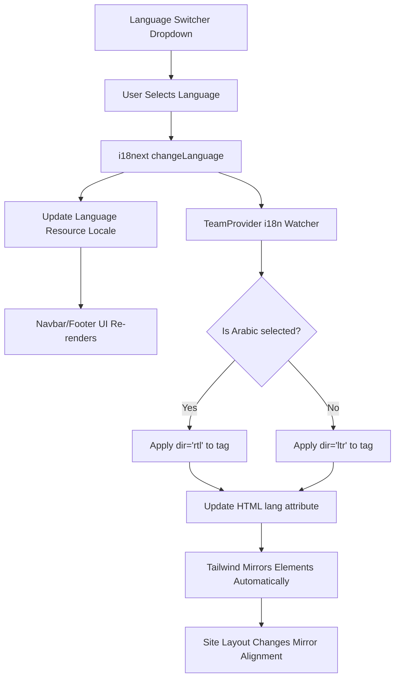

# Multilingual Support (i18n & RTL)

This feature provides seamless language transitions between English, Amharic, and Arabic, with full support for Right-to-Left (RTL) layouts.

## Overview
Powered by **i18next** and **react-i18next**, each language has its own resource file. When Arabic is selected, the system automatically mirrors the layout and adjusts the reading direction.

## Flow Diagram

## Implementation Details

### 1. Language Resources
All strings are moved to JSON locale files:
- `locales/en/common.json` (English)
- `locales/am/common.json` (Amharic)
- `locales/ar/common.json` (Arabic)

### 2. RTL Transition
The `TeamProvider` coordinates the RTL switch. Using `useEffect` on `i18n.language`, it sets `document.documentElement.dir` to `"rtl"` for Arabic and `"ltr"` for English and Amharic.

### 3. Component Updates
All layout components are designed to use relative alignment:
- Use `px-[5%]` for uniform margins.
- Avoid fixed `left` and `right` values.
- Buttons and logos flip their order based on the `flex-direction` change in RTL mode.

## Adding a New Language
To add a new language:
1. Create a new directory in `src/i18n/locales/`.
2. Add a `common.json` file with relevant translations.
3. Register the new resource in `src/i18n/i18n.ts`.
4. Update the dropdown in `Navbar.tsx` to include the language option.
