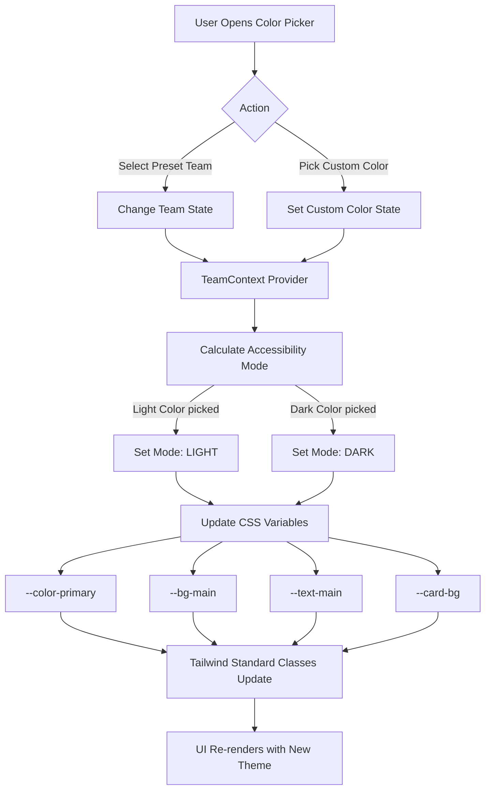

# Dynamic Team Theming & Color Picker

This feature allows users to dynamically switch between predefined brand "Teams" or select any custom color to transform the entire website's visual identity.

## Overview
The system uses a combination of **React Context**, **CSS Variables**, and **Dynamic Theme Mode Detection** to update colors across the entire DOM at runtime.

## Flow Diagram

## Implementation Details

### 1. State Management
The `TeamProvider` manages the `currentTeam` state. When a color is picked, it triggers a `useEffect` that updates global root CSS variables.

### 2. Accessibility Logic (YIQ Contrast)
The system calculates the brightness of the selected color to decide whether the background should be dark or light, ensuring that text remains readable.

### 3. CSS Variables
The following variables are dynamically updated:
- `--color-primary-600`: The selected primary/accent color.
- `--bg-main`: The site-wide background.
- `--text-main`: The primary text color.
- `--card-bg`: Surface colors for cards and navigation bars.

## Usage in Components
Components should avoid hardcoded colors and use the dynamic utility classes:
- Backgrounds: `bg-main`, `bg-card`
- Text: `text-main`, `text-secondary`
- Actions: `btn-primary`, `text-primary-600`
